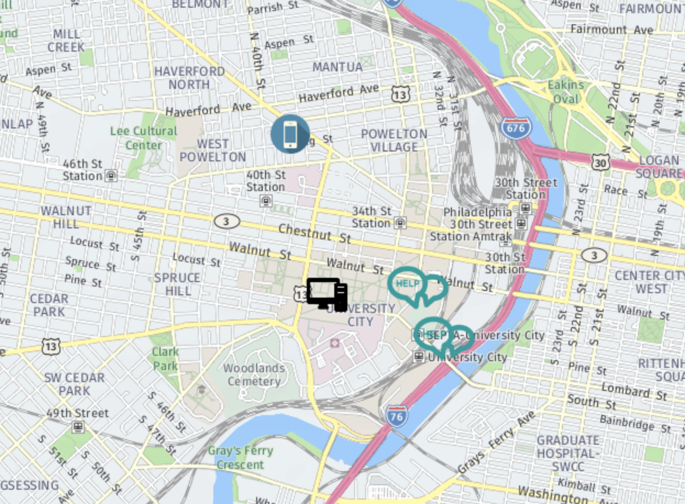

# meshline
MeshLine platform for PennApps XVIII. Communicate with each other during disasters and also communicate to outsiders where you need help to save your life. :rocket:

**meshline is currently in development stage.**

# Getting Started

## Installation
1. Setup ML Classification API
2. virtual environment and install dependencies from `requirements.txt`
3. Setup Node.js/MongoDB

## Quick Demos

---

Be sure to follow the [contribution guidelines](CONTRIBUTING.md) when submitting code. Always abide by the [code of conduct](CODE_OF_CONDUCT.md).
